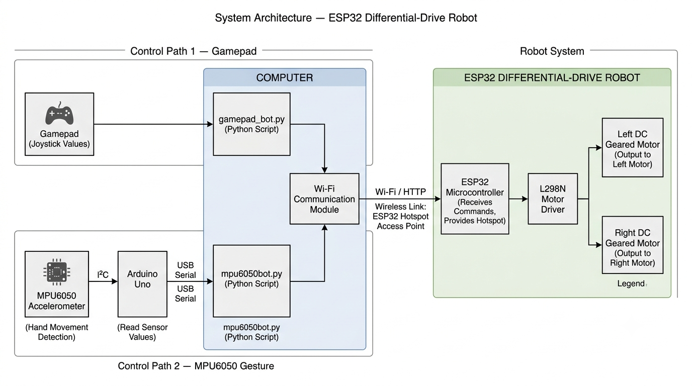

# ESP32 Differential-Drive Robot

A wireless 2-wheel differential-drive robot controlled through two independent input methods: a gamepad and MPU6050-based hand gestures.

## Overview

This project is a 2-wheel differential-drive robot built around an ESP32. The robot receives movement commands wirelessly from a computer over Wi-Fi and uses an L298N motor driver to control two DC geared motors.

The project implements two independent control paths:

1. **Gamepad Control** — joystick values are read by a Python program and transmitted to the ESP32.
2. **MPU6050 Gesture Control** — an MPU6050 connected to an Arduino Uno detects hand movement, sends sensor values to a Python program through USB serial, and the Python program converts the gestures into movement commands.

Both control methods ultimately communicate with the same ESP32 robot controller.

---

## Features

- 2-wheel differential-drive locomotion
- ESP32-based wireless robot controller
- ESP32 Wi-Fi hotspot / access point
- HTTP-based motor command communication
- Gamepad-based control
- MPU6050 accelerometer-based gesture control
- Arduino Uno interface for MPU6050
- Python-based control software
- Differential-drive motor control
- MPU6050 calibration and dead-zone handling

---

## System Architecture



### Gamepad Control Path

```text
Gamepad
   ↓
gamepad_bot.py
   ↓
Wi-Fi / HTTP
   ↓
ESP32
   ↓
L298N Motor Driver
   ↓
Left Motor + Right Motor

MPU6050
   ↓ I²C
Arduino Uno
   ↓ USB Serial
mpu6050bot.py
   ↓
Wi-Fi / HTTP
   ↓
ESP32
   ↓
L298N Motor Driver
   ↓
Left Motor + Right Motor